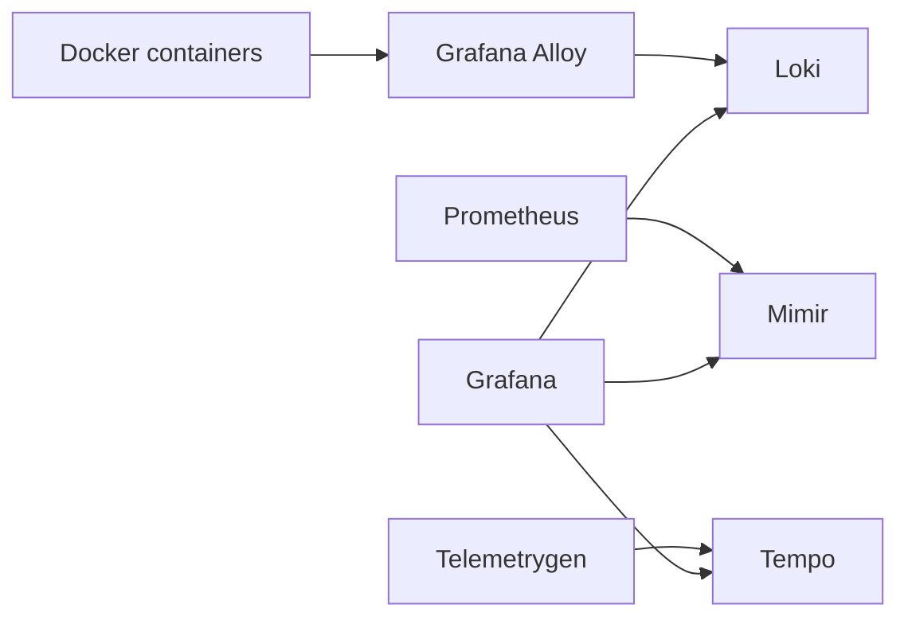

# Architecture

This stack is designed for local development and repeatable observability experiments. It keeps each LGTM backend separate so configuration and failure modes are visible.

## Data Flow

## Components

| Component | Role | Persistence |
| --- | --- | --- |
| Grafana | UI, data source provisioning, exploration | `grafana-data` |
| Loki | Log storage and query API | `loki-data` |
| Tempo | Trace storage and OTLP ingestion | `tempo-data` |
| Mimir | Prometheus-compatible long-term metrics backend | `mimir-data` |
| Prometheus | Scrapes local services and remote-writes to Mimir | `prometheus-data` |
| Alloy | Collects Docker container logs and its own metrics | `alloy-data` |

## Persistence Model

Docker named volumes hold service state. The Compose project can be stopped with `docker compose down` without deleting state. Use `make clean` when you intentionally want a fresh environment.

## Configuration Model

Runtime configuration is split by component under `config/`.

- `config/grafana/provisioning/datasources/datasources.yaml` wires Grafana to Loki, Mimir, and Tempo.
- `config/loki/loki.yaml` runs Loki in single-node filesystem mode with one week retention.
- `config/tempo/tempo.yaml` enables OTLP ingestion and local trace storage.
- `config/mimir/mimir.yaml` runs Mimir in single-binary filesystem mode.
- `config/prometheus/prometheus.yaml` scrapes stack metrics and remote-writes them to Mimir.
- `config/alloy/config.alloy` discovers Docker containers and forwards logs to Loki.

## Local-Only Assumptions

This is not a production deployment. It intentionally uses single replicas, filesystem storage, no TLS, and local credentials. For production, replace filesystem storage with object storage, enable authentication/TLS, define resource limits, and run each backend with a high-availability topology.
