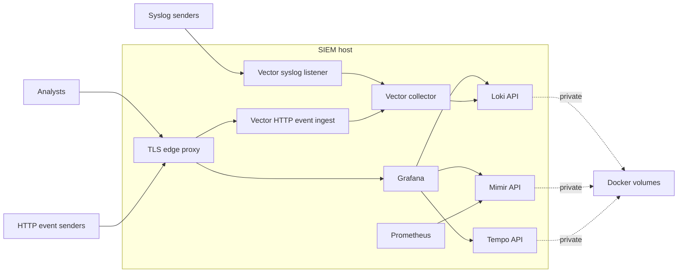

# Security Model

This stack supports a local lab by default and a production-like single-host boundary through the optional `edge` profile. The production guidance is:

- Expose only the TLS edge proxy, approved syslog listener, and any explicitly approved OTLP ingest ports.
- Keep Loki, Mimir, Tempo, Prometheus, Alloy, Vector diagnostics, and collector metrics bound to loopback or private networks.
- Terminate TLS before Grafana and HTTP event ingest.
- Require a bearer token for HTTP event ingest.
- Restrict syslog senders with host firewall rules or upstream network controls.

## Trust Zones



## Default Bindings

The Compose defaults bind backend service ports to `127.0.0.1`. This keeps local workflows convenient while avoiding accidental LAN exposure.

| Surface | Default bind | Production guidance |
| --- | --- | --- |
| Grafana `3000` | `127.0.0.1` | Prefer access through the TLS edge proxy. |
| Loki `3100` | `127.0.0.1` | Keep private. |
| Tempo HTTP `3200` | `127.0.0.1` | Keep private. |
| Tempo OTLP `4317`, `4318` | `127.0.0.1` | Expose only when receiving traces from trusted senders. |
| Mimir `9009` | `127.0.0.1` | Keep private. |
| Prometheus `9090` | `127.0.0.1` | Keep private. |
| Alloy `12345` | `127.0.0.1` | Keep private. |
| Vector diagnostics `8686` | `127.0.0.1` | Keep private. |
| Vector metrics `9598` | `127.0.0.1` | Keep private. |
| HTTP event ingest `8088` | `127.0.0.1` | Prefer access through the TLS edge proxy. |
| Syslog TCP/UDP `5514` | `127.0.0.1` | Bind to a specific interface only after firewall rules are in place. |
| Edge proxy `8443` | `0.0.0.0` when profile enabled | Expose to analysts and HTTP event senders. |

## TLS Edge Proxy

Start the optional TLS edge proxy:

```bash
docker compose --profile edge up -d edge-proxy
```

The proxy listens on `SIEM_EDGE_HTTPS_PORT`, default `8443`, and uses Caddy internal TLS from `config/proxy/Caddyfile`.

Routes:

| Path | Upstream |
| --- | --- |
| `/event`, `/event/*`, `/hec`, `/hec/*` | Vector HTTP event collector |
| everything else | Grafana |

Validate the TLS path:

```bash
make security-boundary-test
```

For production, replace Caddy internal TLS with certificates from the organization PKI or a public CA if the endpoint is internet reachable.

## Firewall Expectations

Allow inbound access only from approved networks:

| Port | Source |
| --- | --- |
| `8443/tcp` | Analyst workstations, automation that sends HTTP events. |
| `5514/tcp` or `5514/udp` | Approved syslog senders only, if syslog is exposed. |
| `4317/tcp` or `4318/tcp` | Approved OTLP senders only, if trace ingest is exposed. |

Do not expose backend APIs such as Loki, Mimir, Tempo, Prometheus, Alloy, or Vector diagnostics to general user networks.

## HTTP Event Token Rotation

Rotate `SIEM_HTTP_EVENT_TOKEN` when a sender is decommissioned, the token is suspected to be exposed, or on the regular secret rotation schedule.

1. Generate a new token with at least 32 bytes of randomness.
2. Update the secret value in `.env` for local/pilot use or in the production secret manager.
3. Restart the collector:

```bash
docker compose up -d --force-recreate siem-collector
```

4. Update each HTTP event sender to use the new bearer token.
5. Send a test event through the TLS edge proxy.
6. Query Loki for the test event and confirm old-token senders are rejected.
7. Record the rotation date, owner, and reason in the change ticket or PR.

For zero-downtime rotation, run a temporary parallel collector endpoint or sender-side dual-write period. The current single-token Vector configuration intentionally keeps the pilot setup simple.

